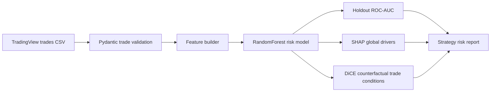

# TradingView Strategy Risk Lab

Model-training lab for TradingView Strategy Tester exports. It trains a bad-trade risk model, exposes a Litestar API, and defines the SHAP/DiCE boundary for explaining why a trade setup looks fragile.



## What It Solves

TradingView exports show trades, but they do not explain which conditions make a strategy fragile. This repo converts trade history into a risk model that can be inspected before a strategy is trusted.

## Stack

Litestar, Pydantic v2, pandas, scikit-learn, SHAP, DiCE, Typer, pytest, ruff.

## Quickstart

```bash
python -m venv .venv
.venv\Scripts\activate
pip install -e ".[dev]"
python -m pytest
python -m ruff check .
tv-risk-lab train
```

Run the API:

```bash
uvicorn tradingview_strategy_risk_lab.api:app --reload
```

## API

| Endpoint | Purpose |
|---|---|
| `POST /v1/train` | Train a strategy-risk model from a local CSV path |
| `GET /v1/explainability-stack` | Show how SHAP and DiCE are used |
| `GET /health` | Health check |

## Notes

This is a strategy review tool, not an execution system. It is meant to stop weak strategies earlier, not automate live trading.

